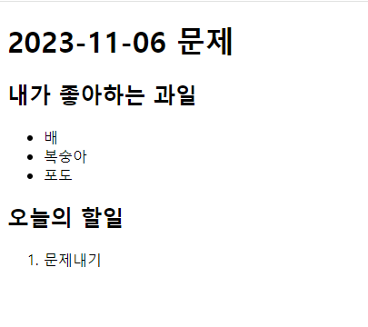
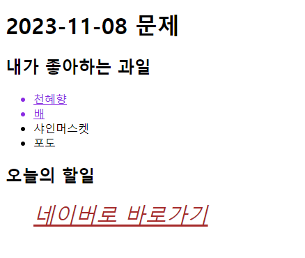

index1.js 는 제가 생각한 답안입니다

요구조건
1. 날짜에 오타가 있는데 08로 수정해세요
  
2. 내가 좋아하는 과일 목록에 천혜향과 샤인머스켓을 추가하시오
(천혜향 1번째, 샤인머스켓3번째)
 
 
3. 복숭아 요소를 삭제해주세요
 
 
4. css파일에 css효과(line, color,pointer)를 과일 목록에 적용해주세요
(개별로 이벤트를 주어도 좋고 bubbling 효과로 주어도 좋습니다. 단, bubbling으로 효과 부여시 발생하는 ul태그의 효과는 제거하고 li 태그에만 효과가 적용되도록 추가적인 수정이 필요합니다.)
 

 
5. 오늘의 할일에서 li태그 문제내기 부분은 a태그 네이버로 바로가기로 수정하고 css속성 font를 적용하시오 
href속성을 추가하여 네이버로 이동할수 있게 하여야합니다.

